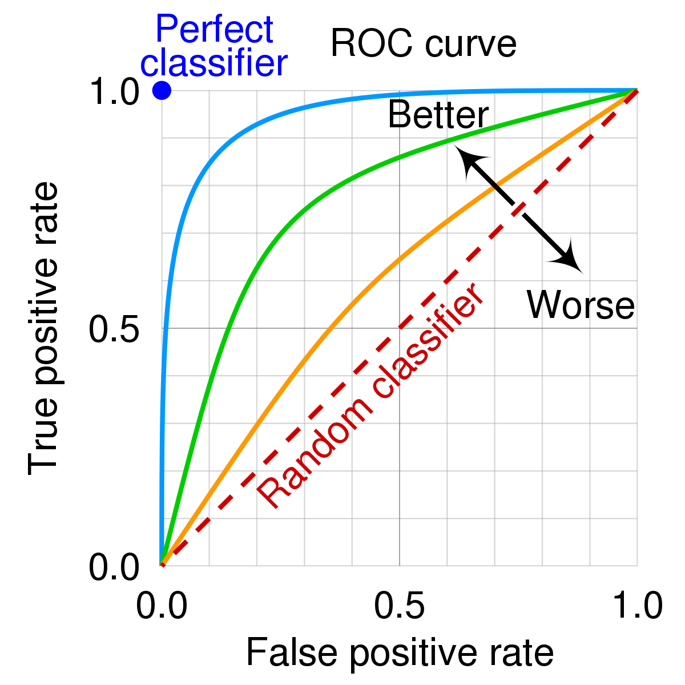

```{r setup, include=FALSE}
knitr::opts_chunk$set(
  warning = FALSE,
  message = FALSE
)
```

# 1. Introduction to supervised learning

Having explored the intrinsic topology of our data "blindly" in Notebook 02, in this third phase of the project we move on to supervised learning. The goal is no longer to discover natural geometric groupings, but to train predictive algorithms capable of learning the biomedical patterns that lead to a specific diagnosis, using the target variable (`diagnosis` or `cvd_risk_level`) as a guide.

In this block, we deploy algorithms with very different mathematical architectures: we start with a traditional parametric model (Penalized Logistic Regression) and move toward more complex heuristics and decision trees, specifically C5.0 with a cost matrix and Random Forest.

These algorithms require calculating hyperparameters to optimize the model before training the final version. To do so, we rely on a 10-fold cross-validation strategy, where each fold (a random but stratified partition of our train set) trains on 9/10 of the data and is evaluated on the remaining 1/10. We select the hyperparameters from the configuration that yields the best evaluation metrics. Once we identify the winning hyperparameters, we train the final model on the complete train set. We already have the specific recipes (`_logistic` or `_trees`) saved from Notebook 01, ready to transform both the raw complete train sets and the fold splits.

To run this entire process, unlike the previous notebook where everything was simpler, we rely on the `tidymodels` ecosystem, specifically `workflows` and `tune`. These packages allow us to encapsulate the recipe, the model, and the hyperparameters into a single object, enabling us to train and evaluate consistently and reproducibly. This allows us to apply the exact same training and evaluation logic to both scenarios (cancer and cardiovascular risk) without rewriting specific code for each one, and, above all, to apply the tuning and hyperparameter selection stage in a unified way.

# 2. Evaluation strategy

Unlike a standard classification problem, biomedical modeling is subject to a deep asymmetry in the cost of errors. In our two scenarios (detecting oncological tissue and assessing severe cardiovascular risk), predicting that a sick patient is healthy (a false negative) leads to the omission of a vital treatment. This is an unacceptable cost compared to subjecting a healthy patient to additional tests (a false positive).

The evaluation of our algorithms, then, cannot depend on a single flat metric. During the tuning phase (hyperparameter optimization on the folds) and in the later internal evaluation, we monitor a full panel of five metrics, some of which are specifically designed to evaluate the model's ability to isolate the pathological class.

### Accuracy

This is the classic reference metric. It measures the proportion of correct predictions over the total number of evaluated cases:

$$Accuracy = \frac{TP + TN}{TP + TN + FP + FN}$$

Where $TP$ are the true positives, $TN$ the true negatives, $FP$ the false positives, and $FN$ the false negatives.

We use it only as a general benchmark. Accuracy can be misleading: in a dataset where 90% of patients are healthy, a useless model that always predicts "healthy" obtains 90% accuracy, tragically failing on the 10% of critical cases. It should always be read alongside the following metrics.

### Sensitivity (Recall / True Positive Rate)

This is our star metric. It quantifies the model's ability to correctly identify patients who actually have the pathological condition:

$$Sensitivity = \frac{TP}{TP + FN}$$

Our main goal during hyperparameter optimization is to maximize this value. We want to reduce false negatives ($FN$) to the absolute minimum, capturing as many at-risk patients as possible.

### F1-Score

Blindly increasing Sensitivity is dangerous (a model that diagnoses every patient as sick has a perfect 100% Sensitivity, but is practically useless). The F1-Score acts as a regulator. It is the harmonic mean between Precision (how many of the patients we diagnose as sick actually are) and Sensitivity:

$$F1 = 2 \times \frac{Precision \times Sensitivity}{Precision + Sensitivity}$$

$$Precision = \frac{TP}{TP + FP}$$

It guarantees that the model maintains a functional balance. We require the algorithm to maximize Sensitivity without the F1-Score collapsing under a flood of false positives.

### Areas under the curve: ROC-AUC and PR-AUC

The three metrics above (Accuracy, Sensitivity, and F1) suffer from a foundational limitation: they are static metrics. They evaluate model quality based on a single, arbitrary decision threshold, assuming the patient can only sit in one of the discrete target states: sick or healthy (cancer), or low/medium/high (CVD). In reality, that is not how our models actually work. The algorithms do not return a fixed state, but a probability. For example, a probability of malignancy below 30%.

By default, models use a 50% threshold to decide between one class or another (in this case, healthy, since 30% \< 50%). In a real clinical setting, we often adjust this threshold manually depending on the severity of the disease. For example, we might want to remove a tumor as soon as there is a 20% probability of malignancy, rather than waiting for the default 50% threshold. Model evaluation, then, cannot depend on a single cut-off point. We need a metric that captures the model's ability to discriminate between classes across the entire spectrum of probabilities. This is where ROC-AUC comes in.

The term ROC refers to a visual representation (typically a curve) of the model's performance across every threshold (from 0% to 100%). To draw the ROC curve, we calculate the true positive rate (TPR, Sensitivity) and the false positive rate (FPR) at every possible threshold (in practice, at selected intervals), and plot TPR against FPR.

{width="326"}

The area under the ROC curve (AUC) represents the probability that, for any given threshold, the model correctly ranks a random pair of patients, one healthy and one sick. An AUC of 0.5 indicates the model has no discriminative power (equivalent to flipping a coin), while an AUC of 1.0 indicates perfect discrimination.

The problem is that the denominator of the false positive rate includes the true negatives (healthy patients correctly identified). In health datasets, healthy patients usually form the vast majority. This massive abundance of healthy cases distorts the formula, pushing the FPR down and artificially inflating the ROC curve.

To correct this bias, we also use the PR-AUC curve (Precision-Recall Area Under Curve). This curve plots Precision against Sensitivity across every threshold.

It is more useful for us given the pathological asymmetry of our data. Since it only uses Precision and Sensitivity, its mathematical formula completely ignores the true negatives. It is not fooled by the abundance of healthy patients. It focuses strictly and exclusively on evaluating how well the model corners and identifies genuinely pathological cases without flooding the system with false positives.

The only issue with these AUC metrics is that we cannot apply them to the C5.0 model, due to the cost matrix we use there. Although the algorithm can extract probabilities from the proportion of cases in its terminal nodes, using a cost matrix distorts these values: the model stops being a neutral probability estimator and becomes a classifier optimized to minimize risk. By biasing the decision thresholds to avoid high-cost errors, the resulting probabilities lose their validity for AUC analysis, which requires an unconditioned, continuous spectrum of thresholds. For the C5.0 model with costs, then, we limit our evaluation to static metrics (Accuracy, F1-Score, and Sensitivity), which directly reflect the impact of the penalty on the final triage outcome.

### Adapting this to our two scenarios

There is one critical point to keep in mind. While the cancer dataset has a binary target variable (ideal for the true/false-positive metrics above), the CVD dataset has three classifications, so it is not immediately obvious how to define a "positive" or "negative" case. Here, the behavior varies depending on the type of metric:

-   For Accuracy, it works exactly the same as in the binary dataset: it simply counts hits and misses (for example, whether a patient classified as "high" actually is).

-   For the rest of the metrics, the algorithm relies on a strategy called "one-vs-rest". The system automatically splits the problem into three independent binary simulations:

    1.  Low class vs. Medium + High classes
    2.  Medium class vs. Low + High classes
    3.  High class vs. Low + Medium classes

    Once the metrics are calculated for each of these three simulations, the results are averaged (macro-average) to obtain a single representative value of the model's ability to discriminate between the three classes.

`tidymodels` and `workflows` let us apply these metrics consistently and uniformly across both scenarios, binary and multiclass, without writing this logic by hand. We built a function (`get_clinical_metrics()`, defined in `03_utils.R`) that instantiates the five agreed-upon metrics using the `yardstick` package (part of the `tidymodels` ecosystem). This way, whenever we want to evaluate a model, we simply call this function and get a consistent set of metrics across every section. We also have `get_hard_metrics()`, which only applies the static metrics, needed specifically for C5.0.

```{r setup-supervised}
# Load our auxiliary functions
source("../R/03_utils.R")
```

# 3. Logistic Regression

To open our predictive arsenal, we use the gold standard of clinical inference: Logistic Regression. Starting with this model is no accident; in a medical and pharmacological setting, it is not enough for a model to be accurate; practitioners need to understand why it reaches a decision. Pure black boxes generate distrust. Since this algorithm is strictly parametric, it provides a final equation where every biomarker has a directly interpretable weight ($\beta$).

Despite having "regression" in its name, we are dealing with a probabilistic classification model (not a continuous-outcome model like linear regression). Its mathematical goal is not to predict a hard class, but to model the continuous probability $P(Y=1|X)$ that a patient belongs to the pathological class (malignant / high risk), given their clinical characteristics (cell area, cholesterol levels, and so on).

The algorithm works in two phases. First, it calculates a linear combination of the predictor variables:

$$z = \beta_0 + \beta_1X_1 + \beta_2X_2 + ... + \beta_nX_n$$

where $z$ is the log-odds (the logarithm of the odds) that the patient belongs to the pathological class, $\beta_0$ is the intercept (bias), and $\beta_i$ are the weights assigned to each predictor variable $X_i$.

However, because $z$ is unbounded (ranging from $-\infty$ to $+\infty$), it makes no sense for expressing a probability. From here, the process differs depending on whether we work with the cancer dataset (a binary outcome) or the CVD dataset (three possible outcomes).

In the cancer scenario, the algorithm passes this $z$ value through a sigmoid (logistic) function in its second phase. This mathematically compresses any real number into a strict range between $0$ and $1$:

$$P(Y=1) = \frac{1}{1 + e^{-z}}$$

where $P(Y=1)$ is the probability that the patient belongs to the pathological class (malignant). As mentioned in the previous section, it is over these continuous probabilities that we evaluate our AUC metrics.

For the cardiovascular (CVD) dataset, the binary approach falls short, as we face a multiclass problem with three risk levels. To handle this, the algorithm applies a mathematical generalization known as Multinomial Logistic Regression. It replaces the sigmoid function with a Softmax function to distribute 100% of the probability across the three possible classes:

$$P(Y=k) = \frac{e^{z_k}}{\sum_{j=1}^{K} e^{z_j}}$$

where $P(Y=k)$ is the probability that the patient belongs to class $k$ (Low, Medium, or High), $z_k$ is the linear combination of predictors for that specific class, and $K$ is the total number of classes.

In this formulation, the model essentially generates three separate linear equations. When evaluating a new patient, the algorithm calculates all three equations independently to obtain three distinct log-odds values. The Softmax function then converts these into bounded probabilities that sum exactly to 1. The patient is ultimately assigned to the class with the highest probability.

But, how does the model determine these optimal $\beta$ weights during training? The algorithm relies on Maximum Likelihood Estimation (MLE). It iteratively adjusts the $\beta$ coefficients to minimize the classification error (specifically, a cost function known as Log-Loss, or cross-entropy) until the probabilities predicted by the model align as closely as possible with the actual target data. We modify this standard optimization process slightly in the next section to introduce regularization.

Finally, like any parametric model, Logistic Regression requires the data to meet specific mathematical assumptions. Unlike Ordinary Least Squares (OLS) regression, it does not require normally distributed residuals or homoscedasticity. It does, however, demand two critical conditions:

1.  **Independence of observations:** guaranteed by the structural design of our datasets (each row represents a distinct, unrelated patient).
2.  **Linearity between continuous predictors and the log-odds:** we evaluated this directly in Notebook 01. While the Breast Cancer dataset clearly satisfies this assumption, the CVD dataset exhibits non-linear relationships across several variables. Although this hurts the linear model's ability to capture complex patterns, we deliberately chose not to apply further artificial transformations beyond our Yeo-Johnson baseline. This allows us to observe empirically how a linear model degrades when this assumption fails, setting a didactic baseline to compare against non-linear decision trees later.

## 3.1 Hyperparameter search

Although classic Logistic Regression is a robust model, in its base mathematical formulation (Maximum Likelihood estimation) it tends to suffer from overfitting when faced with high-dimensional datasets or residual collinearity. In Notebook 01 we mitigated severe multicollinearity, but in a complex biomedical context like cardiovascular risk, variables still retain non-obvious interdependencies that destabilize the $\beta$ coefficients.

To shield our model and prevent it from memorizing noise in the train set, we do not use traditional Logistic Regression, but Penalized Regression through the Elastic Net algorithm (implemented via the `glmnet` engine).

Regularization works by adding a "penalty term" to the model's cost function. Instead of simply minimizing classification error, the algorithm must now minimize the error while keeping the $\beta$ coefficients as small as possible. This forces the model to depend only on truly predictive variables, ignoring noise.

Elastic Net is a linear combination of two classic types of penalty, controlled by two hyperparameters we optimize (tune) through cross-validation:

-   **`penalty`** ($\lambda$): the overall "strength" of the penalty. A high `penalty` value makes the model stricter, forcing the $\beta$ coefficients closer to zero, while a low value lets the model fit the data more freely.

-   **`mixture`** ($\alpha$): controls the mixing proportion between the two regularization philosophies:

    -   $mixture = 1$ is equivalent to applying a Lasso (L1) penalty. This penalty tends to force some coefficients to exactly zero, effectively removing irrelevant variables from the model. It is useful when we suspect only a subset of variables is truly predictive.

    -   $mixture = 0$ is equivalent to applying a Ridge (L2) penalty. This penalty does not force coefficients to zero, but significantly shrinks the coefficients of correlated variables.

In practice, Elastic Net sits between both extremes ($0 < \alpha < 1$) to combine the advantages of both worlds. It can shrink irrelevant variable coefficients to zero (like Lasso) while stabilizing the coefficients of correlated variables (like Ridge).

Since we cannot know *a priori* which combination of `penalty` and `mixture` extracts the best clinical signal, we do not fix them manually. Instead, we declare them as dynamic (`tune()`) and let our 10 cross-validation folds evaluate multiple combinations to empirically find the winning configuration.

First, we recover from our processed data environment the abstract resampling objects (the folds) and the unprepped recipes we built in Notebook 01.

```{r import-logistic-objects}
# Import the cross-validation fold objects (rset)
cancer_folds <- base::readRDS("../data/split/cancer_folds.rds")
cvd_folds    <- base::readRDS("../data/split/cvd_folds.rds")

# Import the unprepped base recipes
cancer_rec_logistic <- base::readRDS("../data/processed/logistic/recipe_cancer_logistic.rds")
cvd_rec_logistic    <- base::readRDS("../data/processed/logistic/recipe_cvd_logistic.rds")
```

Next, we define the mathematical specification of the model. We tell `tidymodels` we want a parametric logistic model, but instead of R's standard engine (`glm`), we invoke `glmnet` to enable Elastic Net regularization, marking its hyperparameters as variables to tune. We also specify that the cancer model is binary (`logistic_reg`), while the CVD model is multinomial (3 classes, via `multinom_reg`).

```{r define-logistic-spec}
# Binary specification (for Breast Cancer)
log_spec_bin <- parsnip::logistic_reg(
  penalty = tune::tune(),
  mixture = tune::tune()
) |>
  parsnip::set_engine("glmnet")

# Multinomial specification (for CVD, 3 classes)
log_spec_multi <- parsnip::multinom_reg(
  penalty = tune::tune(),
  mixture = tune::tune()
) |>
  parsnip::set_engine("glmnet")
```

To orchestrate this process without any risk of data leakage, we encapsulate the recipe and the model inside a `workflows::workflow()` object. This guarantees that, at every cross-validation iteration, the preprocessing transformations (such as dummy encoding and Z-score standardization) are computed strictly on the 9 internal training folds, completely isolating the validation fold. That held-out validation fold is then transformed using exclusively the statistics learned from those 9 training folds, preventing future information from contaminating feature estimation.

```{r create-logistic-workflows}
# We define the workflow for Breast Cancer
cancer_log_wf <- workflows::workflow() |>
  workflows::add_recipe(cancer_rec_logistic) |>
  workflows::add_model(log_spec_bin)

# We define the workflow for Cardiovascular Risk
cvd_log_wf <- workflows::workflow() |>
  workflows::add_recipe(cvd_rec_logistic) |>
  workflows::add_model(log_spec_multi)
```

We construct a regular tuning grid that evaluates 25 distinct hyperparameter combinations (5 levels of `penalty` combined with 5 levels of `mixture`). We then execute the resampling search across our 10 cross-validation folds using the clinical metric set defined in `03_utils.R`. Across both datasets, this block fits and evaluates a total of 500 logistic regression models (25 candidate combinations × 10 folds × 2 datasets). For binary classification (Breast Cancer), class assignment relies on the default 50% probability threshold; for multinomial classification (CVD), each sample is assigned to whichever of the three target classes achieves the highest posterior probability.

```{r tune-logistic-grid}
# We define the hyperparameter search grid (5x5)
log_grid <- dials::grid_regular(
  dials::penalty(range = base::c(-4, -1)),
  dials::mixture(),
  levels = 5
)

# We run cross-validation for Breast Cancer
base::set.seed(42)
cancer_log_tune <- tune::tune_grid(
  cancer_log_wf,
  resamples = cancer_folds,
  grid = log_grid,
  metrics = get_clinical_metrics()
)

# We run cross-validation for Cardiovascular Disease
base::set.seed(42)
cvd_log_tune <- tune::tune_grid(
  cvd_log_wf,
  resamples = cvd_folds,
  grid = log_grid,
  metrics = get_clinical_metrics()
)
```

The resampling outputs store the evaluation metrics computed across all validation folds for each hyperparameter configuration. It is now time to select the optimal hyperparameter combination. Rather than treating all evaluation metrics equally, we tailor our selection strategy directly to the clinical context of the problem.

Because our primary clinical objective is to minimize false negatives, Sensitivity serves as our principal compass. Furthermore, in clinical risk assessment, robust performance across precision-recall trade-offs (PR-AUC) provides a more comprehensive diagnostic picture than single-threshold summaries like the F1-Score. Consequently, we evaluate candidate hyperparameter combinations using a strict clinical priority hierarchy: Sensitivity \> PR-AUC \> F1-Score \> ROC-AUC \> Accuracy.

To implement this logic, our custom selection helper (`get_best_hierarchical()`) first aggregates the out-of-fold mean for each metric combination across all 10 cross-validation folds. It then sorts the candidate configurations sequentially according to this hierarchy before isolating the single top-ranked hyperparameter set.

```{r select-best-logistic-compute}
# We extract the winning hyperparameter combination under the clinical hierarchy
best_cancer_log_params <- get_best_hierarchical(cancer_log_tune)
best_cvd_log_params    <- get_best_hierarchical(cvd_log_tune)

# We isolate the hyperparameter values for final model fitting
best_cancer_log <- best_cancer_log_params |>
  dplyr::select(penalty, mixture)

best_cvd_log <- best_cvd_log_params |>
  dplyr::select(penalty, mixture)
```

```{r select-best-logistic-table-cancer}
base::print(knitr::kable(
  best_cancer_log_params,
  format = "simple",
  digits = 3,
  caption = "Winning hyperparameters (Breast Cancer, Logistic)"
))
```

```{r select-best-logistic-table-cvd}
base::print(knitr::kable(
  best_cvd_log_params,
  format = "simple",
  digits = 3,
  caption = "Winning hyperparameters (CVD, Logistic)"
))
```

Although these metrics reflect internal validation performance across resampling folds, they provide clear diagnostic insights. On the Breast Cancer dataset, regularized Logistic Regression with a `penalty` of 0.018 and a `mixture` of 1 achieves exceptional performance: an average Sensitivity of 0.993, an Accuracy of 0.974, and an F1-Score of 0.980. Furthermore, the threshold-independent metrics remain outstanding (PR-AUC of 0.997 and ROC-AUC of 0.996), confirming that near-linear topological separability allows the model to reliably discriminate malignant cases across the entire decision boundary spectrum.

By contrast, the Cardiovascular Disease model (`penalty` = 0, `mixture` = 0.75) exhibits markedly lower performance: an average Sensitivity of 0.509, indicating that roughly half of the patient profiles across risk strata are misclassified. Overall Accuracy reaches 0.65, the F1-Score sits at 0.525, and ROC-AUC is modest at 0.688. This stark contrast validates our initial hypothesis: cardiovascular risk behaves as a biological continuum characterized by heavy point-cloud overlap and complex non-linear interactions, posing severe geometric challenges that a strictly linear classifier cannot resolve.

## 3.2 Final model training and coefficient analysis

The cross-validation phase has served its purpose: revealing the ideal penalty architecture. However, those models trained on fractions of the folds are temporary. We now need to consolidate our `workflow`, inject the winning hyperparameters, and train the definitive model using 100% of the training data (train set).

First, we load the complete, raw training data (before applying any recipe) for both scenarios.

```{r import-train-data}
# Import the original, raw train sets
cancer_train_raw <- base::readRDS("../data/split/cancer_train_base.rds")
cvd_train_raw    <- base::readRDS("../data/split/cvd_train_base.rds")
```

Next, we define the final workflow. We take the earlier `workflow` (which already contains the recipe, and therefore all its transformations) and attach both the raw train dataset and the winning hyperparameters. Finally, with a call to `fit()`, we train the definitive model, now ready to make predictions on new patients.

```{r fit-final-logistic}
# Finalize the workflow and train the final model (Breast Cancer)
final_cancer_log_wf <- cancer_log_wf |>
  tune::finalize_workflow(best_cancer_log)

base::set.seed(42)
cancer_log_fit <- final_cancer_log_wf |>
  parsnip::fit(data = cancer_train_raw) # We use the raw data here!

# Finalize the workflow and train the final model (CVD Risk)
final_cvd_log_wf <- cvd_log_wf |>
  tune::finalize_workflow(best_cvd_log)

base::set.seed(42)
cvd_log_fit <- final_cvd_log_wf |>
  parsnip::fit(data = cvd_train_raw)
```

The `cancer_log_fit` and `cvd_log_fit` objects contain the resulting workflow from final training, including the applied recipe, the optimized $\beta$ coefficients, and, most importantly, the trained model itself, which we can now use to make predictions.

One of the biggest strengths of Penalized Logistic Regression over "black box" models is its full transparency and interpretability. By extracting the coefficients from the final training run, we see exactly what weight the algorithm assigned to each biomarker.

We display the full coefficient table below, to evaluate both the variables the model considers critical and those it discards as noise.

```{r extract-coefficients-cancer}
# Extract all coefficients from the Breast Cancer model
cancer_log_coefs <- cancer_log_fit |>
  workflows::extract_fit_parsnip() |>
  broom::tidy() |>
  dplyr::arrange(dplyr::desc(base::abs(estimate)))

base::print(knitr::kable(cancer_log_coefs, format = "simple", digits = 3, caption = "Logistic Regression coefficients (Breast Cancer)"))
```

```{r extract-coefficients-cvd}
# Extract all coefficients from the CVD model (multinomial)
cvd_log_coefs <- cvd_log_fit |>
  workflows::extract_fit_parsnip() |>
  broom::tidy() |>
  dplyr::arrange(class, dplyr::desc(base::abs(estimate)))

base::print(knitr::kable(cvd_log_coefs, format = "simple", digits = 3, caption = "Logistic Regression coefficients (CVD)"))
```

First, it is worth clarifying the parameter structure of the multiclass cardiovascular model. Because the target variable comprises three distinct classes, the multinomial formulation fits three separate linear equations (one per class) parameterized jointly via the Softmax function. Consequently, the output table includes an explicit `class` column specifying the equation to which each estimate corresponds, yielding three distinct sets of β coefficients (one per class).

We move on to the interpretation itself. The β parameters (`estimate`) give us exact information on how our models "think".

In the Breast Cancer scenario, we draw several key conclusions. Here, `mixture` is 1, meaning the model applies a pure Lasso penalty. This is a very aggressive feature selection technique that forces many coefficients to exactly zero, keeping only the most essential predictors. Looking at the results, we see that, except for the intercept (-1.177), every single surviving variable carries a positive coefficient. This fits our dataset hypothesis and prior clinical knowledge: there is a direct, linear relationship between larger, more disorganized nuclei and the probability of malignancy. Specifically, we observe that:

-   The `area_mean` variable dominates the equation overwhelmingly, with a weight of 2.464. Mathematically, the model learns that a disproportionate increase in nuclear size is the main tell-tale sign of malignant tissue. It is followed by variables like `smoothness_worst` (0.911), `texture_worst` (0.845), and `radius_se` (0.746).

-   We see how the Lasso penalty does its job perfectly. Variables that likely carry noise or residual collinearity (like `smoothness_mean`, `symmetry_mean`, `compactness_se`, `concave_points_se`, `fractal_dimension_se`, and `fractal_dimension_worst`) neutralize and shrink exactly to 0. The model deliberately ignores them to protect itself from overfitting, resulting in a cleaner, highly pruned, and more robust equation.

On the other hand, in the CVD dataset, the results follow a similar interpretive logic, although cross-validation selects a much more permissive regularization (`penalty` = 0, `mixture` = 0.75). Even with this setup, the algorithm still drastically reduces or "switches off" certain variables.

-   **HIGH:** to diagnose severe risk, the model builds a clinical rule quite consistent with reality. The highest positive weights fall on lifestyle and genetics: a low physical activity level (1.106), family history (0.929), smoking (0.843), diabetes (0.798), and a high BMI (0.392). Just as logically, HDL cholesterol has a protective effect (a negative coefficient, -0.375), indicating that high HDL levels reduce the probability of belonging to the high-risk class. This matches the medical literature remarkably well.

-   **INTERMEDIARY and LOW:** however, when we look at the equations for medium and low risk, we see the model's mathematical failure. To predict the LOW class, the algorithm shrinks age, BMI, total cholesterol, smoking, diabetes, and family history to exactly 0. This makes no clinical sense at all. A young, non-smoking patient with no diabetes should add points toward the "low" class. Here, most of the positive weight in INTERMEDIARY falls on the intercept (1.002) and virtually every other non-zero clinical coefficient is negative, including some that should not be, like smoking (-0.276) or diabetes (-0.251). In LOW we see positive coefficients on variables that are clinically completely mistaken (like assigning positive coefficients to `systolic_bp` [0.295] and `diastolic_bp` [0.238], which implies that higher blood pressure pushes the patient towards low risk), while, as mentioned, the strongest protective predictors from the literature simply zero out.

Why does this happen? Because Logistic Regression can only draw straight lines. Forcing a straight line through a hyper-overlapped, complex cloud of patients confuses the algorithm, which is unable to capture non-linear relationships (for example, the fact that age is only critical if cholesterol is also high).

Consequently, while the model identifies the HIGH risk cohort relatively well (likely isolating extreme marginal values), it struggles to discriminate between low and intermediate risk. Linear parametric models fail to capture the multifactorial nature of cardiovascular risk, where lifestyle, demographic, and biochemical factors interact non-linearly. This structural limitation explains the low cross-validation performance. Clinically, we know these risk factors are meaningful; the issue lies not in their lack of biological relevance, but in the model's inability to represent their interactive geometry.

This contrasts sharply with the Breast Cancer dataset, where the relationship is largely monotonic and linearly separable: greater morphological aberration directly scales with cellular malignancy.

To formally quantify these internal diagnostic differences, we evaluate the models systematically.

> **Note:** when interpreting the coefficients mentioned here, we must understand one thing. For variables that were originally categorical and are now dummy-encoded (0/1), like age group or smoking, the clinical interpretation requires exponentiating their coefficients to obtain the Odds Ratio (OR, eβ). For example, the 0.439 coefficient in the HIGH group for family history translates to an OR of ≈1.55; that is, simply having a genetic history multiplies the odds of high risk by 1.55 compared to a baseline patient with no family history. On the other hand, the interpretation of numeric variables is more abstract: since these predictors went through a Yeo-Johnson transformation followed by Z-score standardization, a one-unit increase in the model does not correspond to a natural biological unit (like a kg/m² of BMI or a mg/dL of cholesterol), but to a one standard deviation increase in the transformed space.

## 3.3 Internal evaluation

Once we have our final model trained on 100% of the train set data, we move on to a formal internal evaluation.

It is worth making a critical methodological note here: calculating predictive metrics using the same data the model just used to fit its parameters ($\beta$) usually results in overly optimistic metrics (overfitting), since we evaluate the model's ability to "remember" itself, not to generalize. Our true expected performance is already rigorously estimated during cross-validation, and the definitive generalization verdict arrives in Notebook 04 using the hidden test set. Even so, this evaluation gives us a first look at how well the model learns to discriminate between classes.

To evaluate internal performance, we generate predictions on the same training data and compare them against the actual target value. Regarding the threshold used to convert continuous probabilities into hard classes, recall that the cancer model is binary, so we apply the classic 50% threshold: if the probability of malignancy is above 0.5, we classify the patient as "Malignant"; otherwise, as "Benign". For the CVD model, being multiclass, we assign the class with the highest probability among the three options (Low, Medium, or High). This matters for the static metrics (Sensitivity, Accuracy, and F1-Score), but is irrelevant for the AUC metrics.

```{r internal-eval-preds-logistic}
# --- A. Recipe preparation ---
# Prep the recipes (calculating means, standard deviations, and so on, over the raw train set)
# This could be pulled directly from the trained workflow, but we prefer to do it explicitly here
cancer_rec_logistic_final <- recipes::prep(cancer_rec_logistic, training = cancer_train_raw)
cvd_rec_logistic_final    <- recipes::prep(cvd_rec_logistic,    training = cvd_train_raw)

# Apply the transformations (bake). We use new_data = *_train_raw to process the entire
# dataset, keeping every original column alongside the transformed ones.
cancer_train_log_baked <- recipes::bake(cancer_rec_logistic_final, new_data = cancer_train_raw)
cvd_train_log_baked    <- recipes::bake(cvd_rec_logistic_final,    new_data = cvd_train_raw)

# --- B. Extraction of the native mathematical models ---
# Extract the model itself from the trained workflow (the glmnet engine with its final beta coefficients)
cancer_log_model <- workflows::extract_fit_parsnip(cancer_log_fit)
cvd_log_model    <- workflows::extract_fit_parsnip(cvd_log_fit)

# --- C. Probability extraction and target linking ---
# Obtain the probabilistic predictions on the transformed train set and bind them to the actual target
cancer_log_train_preds <- cancer_log_model |>
  stats::predict(new_data = cancer_train_log_baked, type = "prob") |>
  dplyr::bind_cols(cancer_train_log_baked |> dplyr::select(diagnosis))

cvd_log_train_preds <- cvd_log_model |>
  stats::predict(new_data = cvd_train_log_baked, type = "prob") |>
  dplyr::bind_cols(cvd_train_log_baked |> dplyr::select(cvd_risk_level))

# --- D. Manual calculation of hard classes ---
# Build the hard-class prediction column (assigning the class with the highest probability).
# We convert the result into a factor with the same levels as the original target, to avoid
# mismatches during evaluation.

# Cancer scenario (binary): classic 50% threshold
cancer_log_train_preds <- cancer_log_train_preds |>
  dplyr::mutate(
    .pred_class = dplyr::if_else(.pred_M > 0.5, "M", "B"),
    .pred_class = base::factor(.pred_class, levels = base::levels(diagnosis))
  )

# CVD scenario (multiclass): the maximum probability among the three options is assigned
cvd_log_train_preds <- cvd_log_train_preds |>
  dplyr::mutate(
    .pred_class = dplyr::case_when(
      .pred_HIGH > .pred_INTERMEDIARY & .pred_HIGH > .pred_LOW ~ "HIGH",
      .pred_INTERMEDIARY > .pred_HIGH & .pred_INTERMEDIARY > .pred_LOW ~ "INTERMEDIARY",
      TRUE ~ "LOW"
    ),
    .pred_class = base::factor(.pred_class, levels = base::levels(cvd_risk_level))
  )
```

```{r internal-eval-preds-logistic-head-cancer}
# --- E. Verification and visual inspection ---
utils::head(cancer_log_train_preds)
```

```{r internal-eval-preds-logistic-head-cvd}
utils::head(cvd_log_train_preds)
```

Next, we pass these predictions through our centralized `get_clinical_metrics()` function. We also plot a fundamental evaluation technique to complement these metrics: confusion matrices. These allow us to directly visualize how many patients are correctly classified and how many are mistakenly assigned to another category, revealing whether the model truly identifies at-risk or malignant records.

We first start with the cancer scenario.

```{r internal-eval-metrics-cancer-logistic}
# yardstick requires the actual target and the estimate to share exactly the same factor levels.
# We dynamically copy the levels from the original target into our predictions.
cancer_log_train_preds <- cancer_log_train_preds |>
  dplyr::mutate(.pred_class = base::factor(.pred_class, levels = base::levels(diagnosis)))

# --- Breast Cancer evaluation (binary) ---
# We pass the probability of the pathological class (Malignant)
cancer_log_train_metrics <- get_clinical_metrics()(
  data     = cancer_log_train_preds,
  truth    = diagnosis,
  estimate = .pred_class,
  .pred_M,
  event_level = "second" # The class of interest is the second level (Malignant)
)

base::print(knitr::kable(cancer_log_train_metrics, format = "simple", digits = 3, caption = "Internal metrics (Breast Cancer, Logistic)"))
```

```{r internal-eval-confusion-cancer-logistic, fig.width=6, fig.height=5}
# Generate the confusion matrix using our centralized function.
cancer_confusion_log <- plot_confusion_matrix(
  data  = cancer_log_train_preds,
  truth = diagnosis,
  title = "Confusion matrix (Logistic): Breast Cancer"
)

cancer_confusion_log
```

The results of this internal evaluation empirically confirm the founding hypothesis we raise in Notebook 01: Logistic Regression, as a linear parametric model, excels in spaces with clear boundaries and a linear relationship to the target, but fails against non-linear complexity.

In the cancer scenario, the penalized model's performance on oncological tissue is outstanding, showing an almost perfectly linear relationship between cell size/deformity and malignancy.

The dynamic metrics (ROC-AUC of 0.995 and PR-AUC of 0.995) tell us the model has stunning discriminative capacity. At the level of raw probabilities, the algorithm distinguishes healthy and diseased cells almost perfectly. Accuracy is also strong, at 97.6%. However, when we look at the static metrics based on the default 50% threshold, Sensitivity sits at 0.947 (94.7%). Looking at the confusion matrix, this translates to 9 false negatives (malignant tissue classified as benign) and 2 false positives. Although this remains a very good value overall (in fact, quite good purely from an ML perspective), from the standpoint of real oncological triage, missing these cases is considered mediocre or even bad. Since we know the PR-AUC is 99.5%, the problem likely lies in the cut-off point, not in the underlying probabilities. If we lower the threshold to 20% or 30%, the number of false negatives drops (although the number of false positives almost certainly rises). We test this.

```{r threshold-experiment-cancer-compute}
# --- Clinical experiment: lowering the threshold to 30% ---
# We adjust the cut-off point manually to prioritize capturing true positives (Sensitivity)
cancer_log_train_preds_2 <- cancer_log_train_preds |>
  dplyr::mutate(
    .pred_class = dplyr::if_else(.pred_M > 0.30, "M", "B"),
    .pred_class = base::factor(.pred_class, levels = base::levels(diagnosis))
  )

# Instantly evaluate the impact using our centralized utils
cancer_log_train_metrics_2 <- get_clinical_metrics()(
  cancer_log_train_preds_2, truth = diagnosis, estimate = .pred_class, .pred_M, event_level = "second"
)
cancer_confusion_log_2 <- plot_confusion_matrix(
  cancer_log_train_preds_2, truth = diagnosis, title = "Confusion matrix (30% threshold)"
)
```

```{r threshold-experiment-cancer-table}
base::print(knitr::kable(cancer_log_train_metrics_2, format = "simple", digits = 3, caption = "Internal metrics (Breast Cancer, 30% threshold, Logistic)"))
```

```{r threshold-experiment-cancer-plot, fig.width=6, fig.height=5}
cancer_confusion_log_2
```

By lowering the decision threshold to 30%, Sensitivity rises to 98.8%, leaving only 2 false negatives. Conversely, false positives increase from 2 to 14. This reflects a classic clinical trade-off: prioritizing the detection of every malignant case inherently increases false positives, triggering additional follow-up evaluations and patient anxiety. From a biomedical standpoint, however, this operational bias is strongly preferred, as the clinical cost of missing a malignancy far outweighs the burden of secondary diagnostic screening. Although Accuracy and the F1-Score experience a minor decline due to this shift, overall performance remains exceptionally robust, making this adjusted threshold the optimal choice.

We now evaluate the CVD scenario.

```{r internal-eval-metrics-cvd-logistic}
cvd_log_train_preds <- cvd_log_train_preds |>
  dplyr::mutate(.pred_class = base::factor(.pred_class, levels = base::levels(cvd_risk_level)))

# --- CVD evaluation (multinomial) ---
# Being multiclass, we pass the probabilities of all three classes simultaneously
cvd_log_train_metrics <- get_clinical_metrics()(
  data     = cvd_log_train_preds,
  truth    = cvd_risk_level,
  estimate = .pred_class,
  .pred_HIGH, .pred_INTERMEDIARY, .pred_LOW
)

base::print(knitr::kable(cvd_log_train_metrics, format = "simple", digits = 3, caption = "Internal metrics (CVD, Logistic)"))
```

```{r internal-eval-confusion-cvd-logistic, fig.width=6, fig.height=5}
cvd_confusion_log <- plot_confusion_matrix(
  data  = cvd_log_train_preds,
  truth = cvd_risk_level,
  title = "Confusion matrix (Logistic): Cardiovascular Risk"
)

cvd_confusion_log
```

Recall that, except for Accuracy, these metrics represent the average across the three classes (HIGH, INTERMEDIARY, and LOW). Here the contrast is drastic: the metrics reveal the severe mathematical limitations of drawing straight lines through a hyper-overlapped, multifactorial clinical space.

The F1-Score (0.487) and macro Sensitivity (0.516) tell us the model fails to correctly corner a patient's actual risk class practically half the time. Accuracy barely scrapes 66.0%, a very mediocre result. This is exactly why we decide to include PR-AUC in our strategy. If we only look at ROC-AUC (0.711), we might think the model is "decent" (much better than a coin flip). This value, however, is inflated by the massive number of true negatives in the one-vs-rest comparisons. PR-AUC (0.522) is not fooled, confirming that the model's real precision on the pathological classes is quite low.

Looking at the confusion matrix, we can calculate Sensitivity (Recall) and Precision (positive predictive value) specifically for each class:

-   The class that fails the most is LOW. Of the 176 patients who actually have low risk, the model only detects 5, representing a Sensitivity of just 2.8%. As for its reliability, of the 13 times the model predicts LOW, it is correct 5 times (a Precision of 38.5%).

-   The HIGH class is the best-detected one. It gets 476 of 582 actual cases right, reaching a Sensitivity of 81.8%. Even so, this generates errors, since of the 682 times the model raises the HIGH alarm, only 476 are correct. This leaves a Precision of 69.8%, creating quite a few false positives (misclassifying 134 intermediate patients and 72 low-risk patients as high).

-   Finally, the INTERMEDIARY class gets 325 of 464 actual cases right (a Sensitivity of 70.0%), and of the 527 times it predicts this class, it is correct 325 times, giving a Precision of 61.7%.

The results give us a clear picture: the model does a decent job at identifying high-risk patients, but struggles to tell apart the low and intermediate groups. In fact, it shows a strong upward bias, often misclassifying intermediate-risk patients as high risk. While catching high-risk cases is important, the model is simply too imprecise for real clinical use. Even so, we keep it to evaluate against the test set, though we know it is not production-ready (at best, it could potentially screen for high-risk profiles, but it cannot handle the full three-class split).

## 3.4 Saving the final models

To close out this model, we save the entire workflow (including the model and the recipe) to an RDS file. This allows us to load it later to make new predictions during the test set evaluation in Notebook 04.

```{r save-logistic-models}
# --- Serialization of logistic models ---
# Ensure the destination directory exists
output_dir <- "../data/models/logistic"
if (!base::dir.exists(output_dir)) {
  base::dir.create(output_dir, recursive = TRUE)
}

# Save the binary model (Breast Cancer)
base::saveRDS(cancer_log_fit, file = base::file.path(output_dir, "cancer_logistic_final_fit.rds"))

# Save the multiclass model (CVD Risk)
base::saveRDS(cvd_log_fit, file = base::file.path(output_dir, "cvd_logistic_final_fit.rds"))

base::cat("Logistic workflows successfully serialized in", output_dir, "\n")
```

# 4. C5.0 decision tree

Having confirmed the severe limitations of Logistic Regression when tracing linear hyperplanes in complex, overlapped pathological spaces (like our cardiovascular dataset), we switch our mathematical approach radically. We leave parametric models and continuous equations behind to explore non-parametric, rule-based models: decision trees, specifically the powerful C5.0 algorithm.

While Logistic Regression sums $\beta$ coefficients across all features simultaneously, a decision tree adopts a recursive "divide-and-conquer" strategy. It partitions the feature space through a sequence of orthogonal splits (IF-THEN rules), creating progressively purer subsets until reaching a terminal diagnosis.

To find optimal thresholds on continuous clinical markers (e.g., blood pressure, glucose), C5.0 relies on Shannon Entropy ($H$) to quantify impurity in a node $S$:

$$H(S) = -\sum_{i=1}^{c} p_i \log_2(p_i)$$

where $c$ is the number of classes (2 for cancer, 3 for CVD) and $p_i$ is the proportion of observations belonging to class $i$ in that node. A completely homogeneous node (e.g., 100% malignant) yields an entropy of 0. At each step, C5.0 evaluates candidate thresholds across predictors and selects the split that maximizes the reduction in entropy (optimizing the Gain Ratio), producing the clearest diagnostic separation.

Compared to parametric models, C5.0 offers distinct advantages:

-   It is scale-invariant. Since the tree only looks for ordinal "cut-off points", it does not matter whether an LDL value is 150 or 15000. This is exactly why, in Notebook 01, we designed the `_trees` recipe by removing the Yeo-Johnson transformation. The algorithm consumes the variables in their real biological units, giving us direct medical rules (e.g. `glucose > 125`).

-   It captures complex dependencies between variables automatically. If age is only a risk factor when the patient smokes, the tree simply creates a "smoker" branch and, underneath it, evaluates age.

-   It captures non-linear relationships between the variables and the target. While Logistic Regression only draws straight lines, a tree creates arbitrary splits in the feature space, adapting to the complexity of the data.

-   It is immune to collinearity. If two variables measure the same thing (area and perimeter), the algorithm uses whichever gives a marginally better split at that node and discards the other, without collapsing mathematically. That is why we decided to keep every variable in the `_trees` recipe, even those that correlate.

Even so, it is not perfect. A clear disadvantage is that trees tend to create hyper-specific rules to memorize the train set (creating leaves with a single patient), that is, overfitting. Also, a slight change in the training data produces a completely different tree. We mitigate this by searching for hyperparameters that prune the tree's growth, keeping it from becoming excessively large.

On top of that, the main reason we choose this model is how easily it lets us apply a cost matrix. In medicine, a false negative (sending home a patient with a malignant tumor or heart attack risk) is lethal, while a false positive (biopsying a benign tumor) is an acceptable cost.

Most machine learning algorithms are statistically "blind" to this asymmetry: to them, failing on the minority class costs exactly the same as failing on the majority class. Although strategies exist to mitigate this (like choosing Sensitivity as our key metric during the logistic regression tuning, or using a low threshold there), C5.0 lets us correct this bias directly and integrally, inside the model itself.

By supplying this cost matrix, the algorithm alters internally how errors are weighted while evaluating entropy. If we penalize a false negative with a 5:1 factor relative to a false positive, the tree prefers "pessimistic" cuts. It forces splits that group together every potential patient, even if that means dragging a few healthy patients into that branch too. This is the algorithmic translation of the medical precautionary principle.

## 4.1 Hyperparameter search

Before launching training, we need to prepare our tree's architecture. There are two conceptual parameters we configure to control the behavior of the C5.0 algorithm.

First, to avoid creating hyper-specific branches (unavoidable if we let the tree grow indefinitely trying to perfectly classify every last patient in the train set), we apply pruning: a mathematical criterion that puts an end to branch growth. This is done through the `min_n` hyperparameter (`minCases` in the underlying C5.0 library), which dictates the minimum number of records that belong to a terminal node. A low `min_n` allows deep, complex trees with a higher risk of overfitting; a high `min_n` forces smaller, more robust trees, pruning splits that capture very little of the population and are likely just statistical noise.

We also have the iterations parameter (`trees` in tidymodels, `trials` in C5.0), which enables Boosting. Boosting is an ensemble technique where, instead of training a single model, it builds a sequence of small, simple trees, with each new tree trying to fix the mistakes of the previous one. The final prediction combines all their votes.

This is somewhat similar to Random Forest, but with a key difference: while boosting learns sequentially from past errors, Random Forest uses Bagging (Bootstrap Aggregating) to train hundreds of independent trees in parallel on random data subsets, then combines them via a democratic vote.

The big downside of enabling boosting in C5.0 is that we lose clinical interpretability. We want a single, readable tree at the end so we can extract exact rules (like telling a practitioner that if a patient has LDL \> 160 and age \> 55, they fall into high risk). Plus, if we want a multi-tree ensemble, we already have Random Forest for that in the next section. For this reason, we deliberately disable boosting by fixing the number of trees strictly to 1. As a result, the only hyperparameter we tune during cross-validation is `min_n`.

To begin, we load the `_trees` recipes we prepped in Notebook 01. We also reuse the same cross-validation folds (`cancer_folds` and `cvd_folds`) from the previous section to keep the model comparison fair.

```{r import-trees-objects}
# Import the unstandardized base recipes (biological units preserved)
cancer_rec_trees <- base::readRDS("../data/processed/trees/recipe_cancer_trees.rds")
cvd_rec_trees    <- base::readRDS("../data/processed/trees/recipe_cvd_trees.rds")

# The cancer_folds and cvd_folds objects are already loaded in the environment from section 3
```

Next, we define the cost matrices exactly as required by the internal engine of the C5.0 package. Rows represent predictions and columns represent the actual clinical truth. We fill in each cell with how much we want that specific outcome to cost (0 on the diagonal for correct predictions, positive elsewhere).

-   **Binary scenario (Cancer):** this is direct and natural. The tree splits the space between malignant and benign. The cost matrix is a simple $2 \times 2$ grid, where we apply a severe penalty to classifying `M` as `B`. We penalize false negatives with a factor of 5.
-   **Multiclass scenario (CVD Risk):** unlike Logistic Regression (which resorts to the one-vs-rest trick or a Softmax function), decision trees are native multiclass classifiers. They calculate entropy directly over the three risk proportions (low, medium, high) simultaneously. Here, the cost matrix becomes a full $3 \times 3$ grid. This lets us set a graded penalty: confusing high risk with a much lower level (the equivalent of a false negative) carries a heavier penalty. Confusing HIGH with LOW gets a catastrophic penalty, while confusing HIGH with INTERMEDIARY gets a high-to-moderate one.

```{r define-cost-matrices}
# Breast Cancer cost matrix (2x2)
# C5.0 requires: rows = prediction, columns = clinical truth
cancer_costs <- base::matrix(
  base::c(0, 1,  # Predict M: if actually M (0), if actually B (1: mild false positive)
          5, 0), # Predict B: if actually M (5: severe false negative), if actually B (0)
  ncol = 2, byrow = TRUE
)
base::dimnames(cancer_costs) <- base::list(base::c("M", "B"), base::c("M", "B"))

# Cardiovascular risk cost matrix (3x3)
# C5.0 requires: rows = prediction, columns = clinical truth
cvd_costs <- base::matrix(
  base::c(0, 1, 2,  # Predict HIGH: if HIGH (0), if INTER (1), if LOW (2)
          3, 0, 1,  # Predict INTER: if HIGH (3), if INTER (0), if LOW (1)
          5, 1, 0), # Predict LOW: if HIGH (5, severe), if INTER (1), if LOW (0)
  ncol = 3, byrow = TRUE
)
base::dimnames(cvd_costs) <- base::list(
  base::c("HIGH", "INTERMEDIARY", "LOW"),
  base::c("HIGH", "INTERMEDIARY", "LOW")
)
```

We build the model specification, telling `tidymodels` we want a `decision_tree` from the `parsnip` package. We set its mode to `classification` and fix the engine to `C5.0`, injecting our cost matrices. As agreed, we only mark `min_n` with `tune()`. By default, the number of trees (`trees`) is fixed at 1, disabling boosting and letting us extract a single, interpretable tree.

```{r define-c50-spec}
# Single-tree C5.0 specification for Breast Cancer
cancer_c50_spec <- parsnip::decision_tree(
  min_n = tune::tune()
) |>
  parsnip::set_mode("classification") |>
  parsnip::set_engine("C5.0", costs = cancer_costs)

# Single-tree C5.0 specification for CVD
cvd_c50_spec <- parsnip::decision_tree(
  min_n = tune::tune()
) |>
  parsnip::set_mode("classification") |>
  parsnip::set_engine("C5.0", costs = cvd_costs)
```

We assemble the workflows, combining the specific `_trees` recipes with this new algorithmic architecture.

```{r create-c50-workflows}
# Workflow for Breast Cancer (C5.0)
cancer_c50_wf <- workflows::workflow() |>
  workflows::add_recipe(cancer_rec_trees) |>
  workflows::add_model(cancer_c50_spec)

# Workflow for Cardiovascular Risk (C5.0)
cvd_c50_wf <- workflows::workflow() |>
  workflows::add_recipe(cvd_rec_trees) |>
  workflows::add_model(cvd_c50_spec)
```

Next, we configure the hyperparameter tuning workflow. Because we disabled boosting, the search space shrinks drastically, leaving `min_n` (the minimum number of samples allowed in a terminal node) as our sole tuning parameter. We evaluate 20 distinct levels for each dataset to identify the value that optimizes model performance.

Although a terminal node could theoretically contain just a single record, doing so yields deeply overfitted trees. Furthermore, the appropriate range for `min_n` varies significantly depending on the characteristics of each dataset. Several factors drive this choice: sample size (e.g., a given `min_n` is far more restrictive in the Cancer dataset with \~500 records than in the CVD dataset with \~1,200 records), topological complexity (Cancer is a cleaner, nearly linear space, whereas CVD is dense and heavily overlapped), and real-world applicability (an overly complex tree is useless in a clinical setting). Consequently, we tailor the search range specifically to each dataset.

-   For the Cancer dataset, trees naturally remain shallow even with low, permissive `min_n` values. We therefore explore a broad range from 10 to 60, covering all sensible pruning levels for its sample size.

-   For the CVD dataset, on the other hand, trees naturally grow much deeper and more complex, even under restrictive settings. Here, we enforce a much higher range (from 40 to 100) to proactively constrain tree depth.

The reasoning behind this strict constraint for CVD is crucial: while extending the search toward lower values might slightly improve raw evaluation metrics, it introduces two major issues. First, it increases the risk of overfitting via hyper-specific branches. Second, and more critically, it destroys real-world applicability. A decision tree loses its purpose if its structure is so massive and intricate that applying it in a clinical environment becomes unfeasible. Because our primary objective with C5.0 is to generate interpretable, actionable rules, we intentionally prioritize a compact, robust tree, even at the cost of minor performance gains.

Finally, we run cross-validation to simulate performance on unseen data. Note that C5.0 does not natively compute probability-based AUC metrics in this context, so we evaluate each pruning configuration using hard, threshold-dependent metrics: Sensitivity, Accuracy, and F1-Score.

```{r tune-c50-grid}
# Search grid: 20 pruning levels
c50_grid_cancer <- dials::grid_regular(
  # Explore min_n from 10 to 60, across 20 levels
  dials::min_n(range = base::c(10, 60)),
  levels = 20
)

c50_grid_cvd <- dials::grid_regular(
  dials::min_n(range = base::c(40, 100)),
  levels = 20
)

# Run cross-validation for Breast Cancer (using hard metrics)
base::set.seed(42)
cancer_c50_tune <- tune::tune_grid(
  cancer_c50_wf,
  resamples = cancer_folds,
  grid = c50_grid_cancer,
  metrics = get_hard_metrics()
)

# Run cross-validation for CVD (using hard metrics)
base::set.seed(42)
cvd_c50_tune <- tune::tune_grid(
  cvd_c50_wf,
  resamples = cvd_folds,
  grid = c50_grid_cvd,
  metrics = get_hard_metrics()
)
```

Once cross-validation is complete, we again rely on our strict metric hierarchy (`get_best_hard_hierarchical()`) to find the pruning level that maximizes the capture of pathological cases (Sensitivity) without collapsing the model's overall balance.

```{r select-best-c50-compute}
# Extract the best configuration using the hard-metric hierarchy
best_cancer_c50_params <- get_best_hard_hierarchical(cancer_c50_tune)
best_cvd_c50_params    <- get_best_hard_hierarchical(cvd_c50_tune)

# Isolate the hyperparameter needed for final training
best_cancer_c50 <- best_cancer_c50_params |> dplyr::select(min_n)
best_cvd_c50    <- best_cvd_c50_params    |> dplyr::select(min_n)
```

```{r select-best-c50-table-cancer}
base::print(knitr::kable(best_cancer_c50_params, format = "simple", digits = 3, caption = "Winning hyperparameters (Breast Cancer, C5.0)"))
```

```{r select-best-c50-table-cvd}
base::print(knitr::kable(best_cvd_c50_params, format = "simple", digits = 3, caption = "Winning hyperparameters (CVD, C5.0)"))
```

In the Breast Cancer scenario, the tree selects a pruning of `min_n = 10`. The model reaches a Sensitivity of 91.3%, alongside an overall Accuracy of 93.2% and an F1-Score of 94.4%. Although these are notably solid results from a general analytical standpoint, seen through the lens of preventive oncological screening they still leave a critical margin of risk. A Sensitivity of 91.3% means that nearly 9% of patients who actually have a malignant tumor initially receive a mistaken diagnosis of benignity, a false-negative rate we want to compress to the absolute minimum in a real clinical context.

In the cardiovascular risk (CVD) scenario, by contrast, the results are devastating and reveal the statistical hostility of this space. By consciously raising the pruning bar to `min_n = 43` to protect the model's applicability, macro Sensitivity drops to an alarming 42.7%, a clinically unacceptable value that performs even below chance on average. With an overall Accuracy of 55.5% and an F1-Score of 50.7%, the model's verdict is clear: the algorithm is completely unable to correctly discriminate between the three risk groups.

It is worth noting that these results are only internal, and only reflect the hyperparameter search stage. We continue to see whether the final trained model changes this picture.

## 4.2 Training and rule extraction

Having determined the optimal pruning architecture for each scenario, and even though the results are somewhat disappointing, we press on and consolidate our workflows, injecting the winning hyperparameters to train the definitive models with 100% of the training data. We use the same raw data (`cancer_train_raw` and `cvd_train_raw`) from the previous section, now processed through the `_trees` recipe.

```{r fit-final-c50}
# Finalize the workflow and train the definitive model (Breast Cancer)
final_cancer_c50_wf <- cancer_c50_wf |>
  tune::finalize_workflow(best_cancer_c50)

base::set.seed(42)
cancer_c50_fit <- final_cancer_c50_wf |>
  parsnip::fit(data = cancer_train_raw)

# Finalize the workflow and train the definitive model (CVD Risk)
final_cvd_c50_wf <- cvd_c50_wf |>
  tune::finalize_workflow(best_cvd_c50)

base::set.seed(42)
cvd_c50_fit <- final_cvd_c50_wf |>
  parsnip::fit(data = cvd_train_raw)
```

As in the previous section, the resulting workflow objects (`cvd_c50_fit` and `cancer_c50_fit`) contain several layers of information: the applied recipe, the trained model, and the final hyperparameters.

Specifically, we extract the model and explore one of C5.0's greatest strengths: its visual interpretability. To do so, we reach down to the mathematical object of the underlying engine (`C5.0`), using the extraction function from the `tidymodels` ecosystem. Once we have the model, we run a `summary()` on it, which shows us:

-   **Metadata:** a summary of the execution environment and model parameters.
-   **Evaluation metrics:** a confusion matrix calculated internally, along with the raw error and the total accumulated penalized cost after applying our asymmetric cost matrices.
-   **Attribute usage:** a list of the attributes used and their percentage of use across the tree.
-   **The decision tree itself:** the logical partition diagram in sequential format. Since we disabled boosting, we only see a single tree. It shows the initial branch and, from there, how it keeps splitting, the criterion used for each split, and, for a terminal node, the number of records that landed there (showing hits and misses, where, for example, 3/1 means 3 patients in that node, 1 of them misclassified).

```{r extract-c50-rules-cancer}
# Extract the native engine and inspect the tree/rules (Breast Cancer)
native_cancer_tree <- cancer_c50_fit |>
  workflows::extract_fit_engine()

base::summary(native_cancer_tree)
```

```{r extract-c50-rules-cvd}
# Extract the native engine and inspect the tree/rules (CVD Risk)
native_cvd_tree <- cvd_c50_fit |>
  workflows::extract_fit_engine()

base::summary(native_cvd_tree)
```

Looking at the summaries, the results are quite striking. In this section, we focus exclusively on interpreting the topology of the trees and the logical rules they generate to reach a decision. We leave the internal evaluation analysis (the exact impact of the cost matrix, or accuracy) for the next subsection, even though the native engine's summaries already hint at part of this information.

Looking at the Breast Cancer scenario, the resulting tree is remarkably small and efficient: it has a size of only 7 terminal nodes and only needs to activate 5 of the 26 variables (excluding the target) available in the `_trees` recipe. This is predictable, given what we discovered in the Notebook 01 EDA: the vast majority of nuclear morphological metrics are, on their own, excellent discriminators of the target (the larger and more deformed the cell, the higher the probability of malignancy). The algorithm detects this signal redundancy and drastically simplifies the decision structure, even with a fairly lax `min_n` of 10, isolating the rules as follows:

-   If the cellular perimeter is contained (`perimeter_worst <= 102.5`), the model defaults to the benign class (B). There is a single exception: if `smoothness_worst > 0.1768`, then 6 cases (2 of them misclassified) are considered malignant.

-   If the perimeter exceeds that limit (`perimeter_worst > 102.5`), we enter an oncological suspicion zone, but the model applies further refinements. For instance, if `texture_worst <= 20.83`, it checks `concave_points_mean` to separate benign from malignant cases. If `texture_worst > 20.83`, the vast majority of cases with a high `concave_points_mean` (\> 0.04951) classify directly as malignant (146 records, 1 error). Cases below that threshold undergo one final check against `radius_worst` to determine the diagnosis.

Attribute usage confirms this hierarchy: `perimeter_worst` leads with 100% usage, acting as the absolute root of the morphological triage. It is followed by `smoothness_worst` (56.61%), `concave_points_mean` (43.39%), `texture_worst` (43.39%), and `radius_worst` as a marginal, last-resort refinement (5.73%).

This decision map is ideal for a real clinical setting, since it gives the pathologist a direct, transparent diagnostic protocol with no strange mathematical transformations. While these cutoffs do not represent standard physical units (such as mm or µm) because the underlying data consists of dimensionless geometric metrics extracted from digitized image pixels, they function effectively as relative morphological thresholds. Applying just these rules, a pathologist reaches a diagnosis quickly. This is where the true magic of an interpretable C5.0 tree lies.

That said, we must understand this model's methodological limitations. Having disabled boosting and forced a single tree, the exact structure of this train set and the seed we use heavily condition the variables and cut-off points selected. Had we applied boosting, variable selection would be more stable and robust against small variations in the data. This pure tree runs the risk of overfitting. Although the first cut rule makes complete sense and matches current clinical consensus (and, in general, so does every other rule), it is possible that some rules, especially the deeper ones, are created specifically to fit our train patients. There is no alternative to compare against; this is simply the first solution the model finds to yield optimal results. Even so, this does not mean these variables, or these combinations, are the best or most optimal ones by any means; no comparisons or iterations took place to truly select the most robust variables and decisions. It is likely that the Random Forest we apply next, by testing many trees at once with different combinations of the train data itself, manages to assemble a set of variables with more real predictive power than these, using more correct and more generalizable combinations.

We can apply the same interpretive process to the CVD dataset. In earlier iterations of the project, this tree looked hyper-specific and heavily branched. Having forced such a strict pruning during cross-validation (`min_n = 43`), the tree shrinks drastically down to a size of just 9 terminal nodes, activating only 7 of the 15 (16, counting the target) variables available in the `_trees` recipe. This compression solves the problem of having an unmanageable maze of rules, but maximizes the risk of oversimplification. Furthermore, unlike the oncological scenario, these rules are read directly in real physical units (e.g., mmHg, mg/dL, kg/m²), offering immediate clinical transparency.

We interpret the tree across its 9 terminal nodes:

-   The root node is, without question, `systolic_bp`. If the patient suffers from severe hypertension (`systolic_bp > 150`), the tree checks their `physical_activity_level`. If activity is high, it classifies the patient as INTERMEDIARY risk. If activity is low or moderate, it classifies the patient directly as HIGH risk.

-   If the patient's blood pressure is controlled (`systolic_bp <= 150`), the tree evaluates `family_history_of_cvd` (88.05% usage):

    -   If there is NO family history (N), it checks `total_cholesterol_mg_d_l`. If cholesterol is low (`<= 201.4`), it predicts INTERMEDIARY risk (a massive block of 294 patients, 126 of them misclassified). If cholesterol is higher, it evaluates `bmi`, but strangely, both branches (above and below 25.15) result in a HIGH risk prediction, carrying many errors.

    -   If there is a family history (Y), `smoking_status` splits the path. Smokers (Y) go straight to HIGH risk (278 cases, 70 errors). For non-smokers, the tree evaluates physical activity and diabetes, largely resulting in HIGH or INTERMEDIARY classifications.

As observed in the tree structure, the model occasionally splits into separate branches that assign identical predicted groups. This phenomenon stems from a mismatch between the tree's logical splitting mechanism and our applied cost matrix: while the algorithm identifies structural opportunities to divide the population and maximize information gain, the stringent clinical error penalty forces it to classify almost any ambiguous branch as HIGH risk out of caution. Consequently, these splits lose their discriminative power, rendering them redundant for practical clinical decision-making as they fail to provide meaningful risk segmentation.

We see in this tree that `systolic_bp` is the key variable, followed by `family_history_of_cvd`, `total_cholesterol_mg_d_l`, and `smoking_status`. The rest of the variables (`physical_activity_level`, `bmi`, `diabetes_status`) are minor or marginal refinements (below 35% usage) that only activate in specific cases. Even so, the variables used match what current medical literature indicates as cardiovascular risk factors: hypertension, family history, and lifestyle factors like cholesterol or smoking. This is a point in the model's favor, since it does not invent strange variables or find spurious correlations.

Interpreting the tree, we also spot a clear problem: the tree completely erases the prediction of the LOW risk class from every terminal node. Every leaf concludes either HIGH or INTERMEDIARY. In fact, of the 9 terminal nodes, 6 classify directly as HIGH and only 3 as INTERMEDIARY. This happens mainly for two reasons:

-   The tree's simplification, due to strict pruning (`min_n = 43`), erases branches that could classify patients as LOW. This is a clear example of how pruning hurts the model's ability to discriminate minority classes.

-   The cost matrix we apply heavily penalizes false negatives on HIGH, but does not penalize false negatives on LOW nearly as much. This makes the model "skew high" and prefer classifying patients as HIGH or INTERMEDIARY, even if some of them actually pose LOW risk. This is a clinical problem, since we cannot afford to ignore low-risk patients.

This result, however, is necessary if we want to keep the requirements we set for this model. We see whether the upcoming Random Forest can help solve these issues.

## 4.3 Internal evaluation

Once our final models are trained on 100% of the training data, we move on to their formal internal evaluation.

To do so, we replicate the exact same methodology we applied for Logistic Regression: we explicitly extract and "bake" the data using our `_trees` recipe, and use the extracted models to generate predictions. Since C5.0 under asymmetric penalization behaves as a hard-decision classifier, we rely on our special `get_hard_metrics()` set, which skips the probabilistic area-under-the-curve calculations.

```{r internal-eval-c50-preds-compute}
# --- A. Explicit recipe preparation and transformation ---
# Prep the recipes on the raw train set
cancer_rec_trees_final <- recipes::prep(cancer_rec_trees, training = cancer_train_raw)
cvd_rec_trees_final    <- recipes::prep(cvd_rec_trees,    training = cvd_train_raw)

# Apply the transformations (bake), keeping every column
cancer_train_trees_baked <- recipes::bake(cancer_rec_trees_final, new_data = cancer_train_raw)
cvd_train_trees_baked    <- recipes::bake(cvd_rec_trees_final,    new_data = cvd_train_raw)

# --- B. Model extraction ---
# Extract the parsnip model from the final workflow
cancer_c50_model <- workflows::extract_fit_parsnip(cancer_c50_fit)
cvd_c50_model    <- workflows::extract_fit_parsnip(cvd_c50_fit)

# --- C. Hard prediction and target linking ---
# Generate direct class predictions (type = "class")
cancer_c50_train_preds <- cancer_c50_model |>
  stats::predict(new_data = cancer_train_trees_baked, type = "class") |>
  dplyr::bind_cols(cancer_train_trees_baked |> dplyr::select(diagnosis))

cvd_c50_train_preds <- cvd_c50_model |>
  stats::predict(new_data = cvd_train_trees_baked, type = "class") |>
  dplyr::bind_cols(cvd_train_trees_baked |> dplyr::select(cvd_risk_level))

# --- D. Factor level alignment ---
# Dynamically synchronize the original target levels into our predictions
cancer_c50_train_preds <- cancer_c50_train_preds |>
  dplyr::mutate(.pred_class = base::factor(.pred_class, levels = base::levels(diagnosis)))

cvd_c50_train_preds <- cvd_c50_train_preds |>
  dplyr::mutate(.pred_class = base::factor(.pred_class, levels = base::levels(cvd_risk_level)))

# --- E. Hard internal metric evaluation ---
# Evaluate Breast Cancer, explicitly indicating the pathological event is the second class (M)
cancer_c50_train_metrics <- get_hard_metrics()(
  data        = cancer_c50_train_preds,
  truth       = diagnosis,
  estimate    = .pred_class,
  event_level = "second"
)

# Evaluate CVD
cvd_c50_train_metrics <- get_hard_metrics()(
  data     = cvd_c50_train_preds,
  truth    = cvd_risk_level,
  estimate = .pred_class
)
```

```{r internal-eval-c50-preds-table-cancer}
base::print(knitr::kable(cancer_c50_train_metrics, format = "simple", digits = 3, caption = "Internal metrics (Breast Cancer, C5.0)"))
```

```{r internal-eval-c50-preds-table-cvd}
base::print(knitr::kable(cvd_c50_train_metrics, format = "simple", digits = 3, caption = "Internal metrics (CVD, C5.0)"))
```

Although we already saw the confusion matrices in the native engine's summary, we now generate them explicitly and visually to interpret them more easily.

```{r internal-eval-c50-plot-cancer, fig.width=6, fig.height=5}
# Generate the visual confusion matrix: Breast Cancer
cancer_confusion_c50 <- plot_confusion_matrix(
  data  = cancer_c50_train_preds,
  truth = diagnosis,
  title = "Confusion matrix (C5.0): Breast Cancer"
)

cancer_confusion_c50
```

```{r internal-eval-c50-plot-cvd, fig.width=6, fig.height=5}
# Generate the visual confusion matrix: CVD
cvd_confusion_c50 <- plot_confusion_matrix(
  data  = cvd_c50_train_preds,
  truth = cvd_risk_level,
  title = "Confusion matrix (C5.0): Cardiovascular Risk"
)

cvd_confusion_c50
```

The results are very encouraging in the oncological scenario. For breast cancer, we obtain a striking 98.2% Sensitivity, missing only 3 patients (false negatives). Although the ideal number in a preventive screening is always 0, we are already looking at very solid and safe operational figures. Accuracy sits at 98.2%, and the F1-Score at 97.6%; these metrics are slightly penalized by 5 false positives, but fully justifiable in a medical context (an unnecessary biopsy is preferable to missing a tumor). With these metrics, C5.0 performs virtually on par with the Penalized Logistic Regression model. Although Logistic Regression edges slightly ahead with 98.8% Sensitivity (when adjusted to a 30% threshold), it does so at the cost of generating more false positives than C5.0. Both approaches exhibit excellent predictive capacity. This empirically demonstrates that, for datasets featuring a clear, linear morphological association between features and the target (as established in Notebook 01), deploying flexible non-parametric models like C5.0 is not strictly necessary; a well-designed parametric linear model proves equally valid and sufficient.

Looking at the cardiovascular risk (CVD) results, the situation is much more disappointing, exactly as we anticipated when reading the tree's rule structure. Here we find a macro Sensitivity of 44.8%, indicating a collapse in overall diagnostic ability. With an Accuracy of 59.0% and an F1-Score of 61.8%, the verdict is clear: the model is unusable for correctly classifying the full risk continuum.

The confusion matrix exposes the underlying structural flaw: to satisfy the strict demands of the asymmetric cost matrix, the algorithm opts for extreme caution and completely omits the LOW class from its terminal nodes (driving both its Sensitivity and Precision to 0%). As a result, not a single patient is assigned a low-risk diagnosis.

This explains why the model looks quite good at detecting severe cases, reaching 82.8% Sensitivity for the HIGH class (correctly identifying 482 of the 582 actual critical patients). It does so, however, by skewing results and massively dragging in healthier patients: it misclassifies 225 intermediate-risk patients and 85 low-risk patients as HIGH. This completely sinks its reliability, leaving it with a class Precision (PPV) of 60.9% (of the 792 times it predicts HIGH, a large portion are false alarms).

For the INTERMEDIARY class, its real performance drops to a poor 51.5% Sensitivity (only 239 correctly classified out of 464 possible) and a Precision of 55.6% (out of 430 predictions, 239 are correct).

Again, just as with Logistic Regression, this model could still be useful if our only clinical goal is to isolate high risk (as an ultra-sensitive, defensive alarm), but it is a poor system for genuinely profiling and discriminating low or intermediate risk patients, ending up even more conservative and destructive in that regard than the linear model.

In fact, it is surprising that the results are, overall, worse than Logistic Regression's in terms of Accuracy and macro Sensitivity (a model theoretically weaker for problems with complex, often non-linear interactions like this one). This happens because, even though C5.0 is a non-parametric, flexible model, forcing strict pruning and disabling boosting causes it to lose much of its ability to generalize and discriminate. Logistic Regression, although simpler, manages to keep a slightly better balance across classes thanks to its parametric nature and its regularization. We see whether Random Forest can fix this and deliver better results.

## 4.4 Saving the final models

To close out this decision-tree block, we save the final workflows (encapsulating both the trained C5.0 engine with its optimal pruning and our specific `_trees` recipe) to RDS files.

This serialization step is essential, since it lets us load the models intact later in Notebook 04, to make the definitive predictions on the test set and finally evaluate their true performance against completely blind data.

```{r save-c50-models}
# --- Serialization of C5.0 models (decision trees) ---
# Ensure the specific destination directory for trees exists
output_dir <- "../data/models/trees"
if (!base::dir.exists(output_dir)) {
  base::dir.create(output_dir, recursive = TRUE)
}

# Save the Breast Cancer model (C5.0)
base::saveRDS(cancer_c50_fit, file = base::file.path(output_dir, "cancer_c50_final_fit.rds"))

# Save the Cardiovascular Risk model (C5.0)
base::saveRDS(cvd_c50_fit, file = base::file.path(output_dir, "cvd_c50_final_fit.rds"))

base::cat("C5.0 workflows successfully serialized in", output_dir, "\n")
```

# 5. Random Forest

As mentioned in the previous section, one of the main drawbacks of applying pure C5.0 without boosting is its extreme fragility and instability. Because its rules derive from a single, deterministic pass over the training data, the resulting model often lacks robustness and struggles to generalize. Random Forest resolves this limitation through an ensemble philosophy: instead of relying on the perspective of a single decision tree, it trains hundreds of diverse, independent trees and aggregates their predictions via a simple majority vote (bagging).

To ensure this collective panel acts as a genuinely wise expert group rather than an echo chamber repeating the same errors, Random Forest introduces stochastic variance into the training pipeline through two core mathematical mechanisms:

-   **Bagging (Bootstrap Aggregating):** each individual tree does not train on 100% of the training observations. Instead, the algorithm builds a bootstrap sample (random sampling with replacement) matching the size of the original dataset. Consequently, each tree observes some records multiple times while omitting others entirely (these are known as out-of-bag, OOB, data). This mechanism ensures every tree evaluates the clinical cohort from a slightly different angle.

-   **Random predictor selection (random subspaces):** this represents the core mechanism of Random Forest. While a standard C5.0 tree evaluates every available predictor at each node to find the optimal split, Random Forest restricts each split to a random subset of variables, controlled by the hyperparameter $m$ (or `mtry`). With p total features, standard heuristics typically set this subset size to approximately $\sqrt{p}$.

    This temporary restriction forces tree decorrelation. If a dominant feature like `systolic_bp` dictates every primary split in a single tree, restricting variable selection forces alternative trees to explore secondary signals (such as lipid profiles or glycemic markers), uncovering latent, non-linear interactions that a deterministic model would otherwise miss.

Together, bagging and random subspace selection yield a thorough, low-bias exploration of the feature space. Although individual trees remain relatively weak and imprecise, their aggregation creates a robust, highly generalizable ensemble. Because the resulting predictive rules emerge from a diverse pool of structures rather than a single pass, they generalize significantly better than a standalone C5.0 tree.

At the node level, rather than relying on Shannon Entropy and Information Gain, standard Random Forest implementations evaluate splits using Gini Impurity ($G$). This metric quantifies the probability of misclassifying a randomly selected observation from a node if assigned a class label proportional to the node's true distribution:

$$
G = 1 - \sum_{i=1}^{c} p_i^2
$$

where $c$ represents the total class count (two for breast cancer, three for CVD) and $p_i$ denotes the proportion of class $i$ instances within that node. Gini impurity measures how mixed a node is: a completely pure node (e.g., 100% malignant samples) has a score of 0, while an even mix yields the highest value. At every split, the algorithm selects the feature threshold that minimizes this impurity, driving the branches toward maximum homogeneity.

By repeating this process across an ensemble of $B$ decorrelated trees, Random Forest significantly reduces variance compared to a single decision tree, preventing overfitting while maintaining strong predictive performance.

Like C5.0, Random Forest retains key non-parametric advantages: it requires no scaling or transformations, handles multicollinearity robustly by distributing feature importance across correlated attributes, and natively captures complex non-linear structures. Consequently, we feed the ensemble the exact same `_trees` recipe, preserving raw biological units.

This predictive power introduces a trade-off: the complete loss of direct visual interpretability. Transitioning from C5.0's transparent rule sets to an ensemble turns the model into a black box, precluding simple IF-THEN flowchart extractions. To address this limitation, we rely on aggregate variable importance measures rather than isolated rules. Furthermore, because standard Random Forest engines lack native support for asymmetric cost matrices, we compensate for false-negative penalties by leveraging the ensemble's internal resampling strength alongside a strict hyperparameter optimization strategy focused primarily on Sensitivity.

## 5.1 Hyperparameter search

Before assembling our Random Forest, we must define the architecture governing the individual decision trees that form the ensemble.

The first design decision involves setting the total number of trees (`trees`). In standard practice, this parameter can be optimized by tracking the Out-of-Bag (OOB) error convergence curve. Because each tree leaves out a random subset of observations during bootstrapping (the out-of-bag data), these unseen samples can be used to calculate an internal prediction error as the forest grows. Plotting this OOB error against the number of trees typically reveals an initial steep drop followed by an asymptote. Finding where this curve flattens out identifies the point of diminishing returns (where adding more trees ceases to reduce ensemble variance and only increases computation time).

Even so, we will not tune this parameter empirically. While packages like `randomForest` make it straightforward to extract and plot this progression directly, our `workflow` relies on the `ranger` engine for computational efficiency, which does not expose this tracking curve natively within the tuning interface. Instead, we adopt a standard and conservative threshold of 500 trees. At this ensemble size, the variance is virtually guaranteed to have stabilized.

With the forest size fixed, we mark two key structural hyperparameters as dynamic (`tune()`) for empirical optimization across our 10-fold cross-validation:

-   **`mtry`:** the core mechanism behind tree decorrelation. It controls how many candidate predictors each tree is allowed to evaluate at each candidate split. Setting `mtry` too high (near the total feature count) reduces diversity, causing trees to resemble one another and eroding the ensemble benefit. Conversely, setting it too low forces trees to seek out alternative, secondary predictive pathways, but can result in excessively weak individual estimators.

-   **`min_n`:** the minimum number of samples required to split a node. While Random Forest inherently resists overfitting through feature bagging, tuning `min_n` prevents trees from splitting on isolated outliers, filtering out residual biological noise at the terminal leaves.

We now define the `ranger` engine specification, enabling Gini impurity tracking to evaluate feature importance downstream.

```{r define-rf-spec}
# Random Forest specification for Breast Cancer (binary)
rf_spec_cancer <- parsnip::rand_forest(
  mtry  = tune::tune(),
  min_n = tune::tune(),
  trees = 500 # Fix the forest size to guarantee convergence
) |>
  parsnip::set_mode("classification") |>
  # Enable "impurity" to calculate Gini-based variable importance later on
  parsnip::set_engine("ranger", importance = "impurity")

# Random Forest specification for CVD (multiclass)
rf_spec_cvd <- parsnip::rand_forest(
  mtry  = tune::tune(),
  min_n = tune::tune(),
  trees = 500
) |>
  parsnip::set_mode("classification") |>
  parsnip::set_engine("ranger", importance = "impurity")
```

Next, we recycle the `_trees` recipes already loaded in the previous section and assemble the workflows, combining the raw biological recipes (with no standardization or Yeo-Johnson transformation) with the new `ranger` engine specification.

```{r create-rf-workflows}
# Workflow for Breast Cancer (Random Forest)
# Reuses the _trees recipe loaded in section 4
cancer_rf_wf <- workflows::workflow() |>
  workflows::add_recipe(cancer_rec_trees) |>
  workflows::add_model(rf_spec_cancer)

# Workflow for Cardiovascular Risk (Random Forest)
cvd_rf_wf <- workflows::workflow() |>
  workflows::add_recipe(cvd_rec_trees) |>
  workflows::add_model(rf_spec_cvd)
```

We now define the search grids. There is a critical technical detail here: the maximum value of `mtry` cannot exceed the total number of predictor variables available in the dataset.

-   The cancer recipe has 26 morphological variables (27 counting the target).
-   The cardiovascular risk recipe has 15 clinical variables (16 counting the target).

We enforce upper bounds strictly within these limits to prevent execution errors in the `ranger` engine.

For `min_n`, the constraints can be far more permissive than in C5.0. Because Random Forest is inherently resilient to overfitting through bagging and decorrelation (and because we do not require shallow trees for direct flowchart interpretation), we avoid artificially high minimum node sizes. Instead, we evaluate a spectrum ranging from deep, permissive splits (`min_n = 5`) to moderately conservative values (`min_n = 50`).

We construct a regular grid crossing 5 levels of `mtry` and 5 levels of `min_n`, yielding 25 configurations per scenario. Evaluated across 10-fold cross-validation, this fits 250 ensemble models per dataset (500 models in total). With each ensemble comprising 500 trees, the search evaluates a cumulative 250,000 individual decision trees, demanding significantly higher computational resources than the preceding models.

```{r tune-rf-grid}
# Hyperparameter grid for Breast Cancer (25 combinations)
rf_grid_cancer <- dials::grid_regular(
  # Explore from 2 random variables per split, up to 25
  dials::mtry(range = base::c(2, 25)),
  # Explore min_n from deep splits (5) to more conservative ones (50)
  dials::min_n(range = base::c(5, 50)),
  levels = 5
)

# Hyperparameter grid for CVD (25 combinations)
rf_grid_cvd <- dials::grid_regular(
  # CVD has fewer variables (15), so we cap the maximum at 14
  dials::mtry(range = base::c(2, 14)),
  dials::min_n(range = base::c(5, 50)),
  levels = 5
)

# --- Cross-validation runs ---

# Run for Breast Cancer, recovering every clinical metric
base::set.seed(42)
cancer_rf_tune <- tune::tune_grid(
  cancer_rf_wf,
  resamples = cancer_folds, # Reuse the same folds
  grid = rf_grid_cancer,
  metrics = get_clinical_metrics()
)

# Run for CVD, recovering every clinical metric
base::set.seed(42)
cvd_rf_tune <- tune::tune_grid(
  cvd_rf_wf,
  resamples = cvd_folds,
  grid = rf_grid_cvd,
  metrics = get_clinical_metrics()
)
```

We select the optimal configurations using our established clinical priority hierarchy: Sensitivity \> PR-AUC \> F1-Score \> ROC-AUC \> Accuracy. Because Random Forest outputs undistorted class probabilities via democratic tree aggregation (unaffected by an asymmetric loss matrix), the threshold-independent metrics (ROC-AUC and PR-AUC) remain fully valid for model evaluation.

```{r select-best-rf-compute}
# Extract the best combination under our integral metric hierarchy
best_cancer_rf_params <- get_best_hierarchical(cancer_rf_tune)
best_cvd_rf_params    <- get_best_hierarchical(cvd_rf_tune)

# Isolate the hyperparameters, needed to inject into the final training run
best_cancer_rf <- best_cancer_rf_params |> dplyr::select(mtry, min_n)
best_cvd_rf    <- best_cvd_rf_params    |> dplyr::select(mtry, min_n)
```

```{r select-best-rf-table-cancer}
base::print(knitr::kable(best_cancer_rf_params, format = "simple", digits = 3, caption = "Winning hyperparameters (Breast Cancer, Random Forest)"))
```

```{r select-best-rf-table-cvd}
base::print(knitr::kable(best_cvd_rf_params, format = "simple", digits = 3, caption = "Winning hyperparameters (CVD, Random Forest)"))
```

For cancer, the model selects an architecture of `min_n = 5` and `mtry = 2`. Given our 26 available predictors, this `mtry` is quite conservative compared to the standard heuristic of taking the square root of the feature count ($\approx 5.01$). This is likely due to signal redundancy: as we mentioned several times, one or two variables are probably enough to explain malignancy, given how clear and univariately evident the linear relationship is for practically every variable in this dataset, as we saw in Notebook 01. Since `min_n` is low, the terminal nodes are fairly deep, although that should not be an issue for Random Forest. The metrics are quite good: a Sensitivity of 97.9% during internal cross-validation (with no shortcuts, evaluated on the hidden folds) tells us the forest corners positive cases almost perfectly. A PR-AUC of 0.996 and a ROC-AUC of 0.994 confirm that the probabilities emitted by the democratic vote of the 500 trees are statistically pure and reliable at any threshold.

For the cardiovascular dataset, the model similarly selects an architecture of `min_n = 5` and `mtry = 2`. Here we see a very different pattern compared to the initial assumption: instead of evaluating nearly all features, the algorithm optimizes by restricting each split to just 2 random variables. This forces extreme decorrelation among individual trees, enabling them to uncover alternative non-linear interactions across the overlapping cardiovascular feature space. However, the cross-validation metrics confirm that the model remains severely limited, yielding quite poor performance: an Accuracy of 0.633, an F1-Score of 0.548, a macro Sensitivity of 0.491, a ROC-AUC of 0.765, and a PR-AUC of 0.606. Let us see whether the internal evaluation on the training set reveals a better performance.

## 5.2 Final model training and variable importance

The next step is identical to our usual methodological routine: we inject these winning hyperparameters into their corresponding workflows and train the definitive Random Forest using 100% of the patients available in our original, raw train sets. The `_trees` recipe (which preserves the biological units intact) processes them under the hood.

```{r fit-final-rf}
# --- Consolidation and final training ---

# Finalize the workflow and train the definitive model (Breast Cancer)
final_cancer_rf_wf <- cancer_rf_wf |>
  tune::finalize_workflow(best_cancer_rf)

base::set.seed(42)
cancer_rf_fit <- final_cancer_rf_wf |>
  parsnip::fit(data = cancer_train_raw)

# Finalize the workflow and train the definitive model (CVD Risk)
final_cvd_rf_wf <- cvd_rf_wf |>
  tune::finalize_workflow(best_cvd_rf)

base::set.seed(42)
cvd_rf_fit <- final_cvd_rf_wf |>
  parsnip::fit(data = cvd_train_raw)
```

As explained in the theoretical introduction, the price to pay for Random Forest's immense predictive robustness is the loss of direct visual interpretability. Unlike C5.0, where we extract and print the logical flow diagram, here we cannot print a decision tree, since we literally have 500 distinct trees operating in parallel.

Still, in a medical setting, we cannot settle for a completely opaque model. We need to analyze which biomarkers drive the diagnosis within the forest. To achieve this, we rely on calculating Feature Importance.

When we defined our model's mathematical specification in the previous section, we told the `ranger` engine to enable internal importance tracking (`importance = "impurity"`). This tells the algorithm to track the statistical impact of each variable based on Gini Impurity.

The mechanism works as follows:

1.  Across the 500 trees, every time a variable (for example, LDL cholesterol) is selected to perform a split, the algorithm measures the impurity reduction that split generates. That is, it calculates how mixed the patients are before the split, and how pure the two resulting groups become.
2.  This impurity reduction is summed and accumulated for that variable across the thousands of nodes where it is used throughout the entire forest.
3.  Finally, the results are averaged. Variables that achieve the largest impurity reductions (those that produce cleaner, more precise splits between healthy/sick patients) get the highest score, crowning them as the model's most critical predictors.

To keep this report clean, we encapsulate the extraction logic from the `vip` package and the visual rendering into a custom auxiliary function (`plot_rf_importance()`, defined in `03_utils.R`). This function pulls the Gini metrics from the model (contained inside the final trained workflow) and generates the ranking.

```{r extract-rf-importance-cancer, fig.width=10, fig.height=8}
# --- Variable importance extraction (Gini): Breast Cancer (26 variables) ---
cancer_rf_vip <- plot_rf_importance(
  rf_fit = cancer_rf_fit,
  num_features = 26,
  plot_title = "Global predictor importance: Breast Cancer (RF)",
  plot_subtitle = "Metric: cumulative Gini impurity reduction",
  fill_color = "#e74c3c"
)

cancer_rf_vip
```

```{r extract-rf-importance-cvd, fig.width=10, fig.height=8}
# --- Variable importance extraction (Gini): Cardiovascular Risk (15 variables) ---
cvd_rf_vip <- plot_rf_importance(
  rf_fit = cvd_rf_fit,
  num_features = 15,
  plot_title = "Global predictor importance: CVD Risk (RF)",
  plot_subtitle = "Metric: cumulative Gini impurity reduction",
  fill_color = "#3498db"
)

cvd_rf_vip
```

For the cancer scenario, it is interesting to see that much of what we find here matches exactly the results we obtain from the association tests against the target in Notebook 01. Leading the ranking are `perimeter_worst`, `concave_points_worst`, `concave_points_mean`, `radius_worst`, and `area_worst`. This matches what we already discussed there: it is precisely the worst-case measurements that carry the most information for discriminating between benign and malignant tissue. Even so, it is interesting that these are not the only relevant variables; to a lesser extent, many `_mean` variables, and even some `_se` variables, also carry weight. Although the different metric types are generally intermixed, we still spot certain tendencies:

-   There is a higher concentration of `_se` variables in the lower half (low usage) than in the upper half. `_worst` variables, as mentioned, sit near the top almost consistently, while `_mean` variables show more erratic behavior.

-   Size-related measurements (perimeter, area, radius) are among the most used.

-   Texture, symmetry, and especially fractal dimension or smoothness tend to sit near the bottom.

-   Concave points and concavity look very useful, but mainly through their `_worst` or `_mean` versions (their `_se` counterparts fall toward the bottom instead).

For CVD, we see that the most important variable is `bmi`, closely followed by `estimated_ldl_mg_d_l`, `age`, `systolic_bp`, `total_cholesterol_mg_d_l`, and `hdl_mg_d_l`. Unlike the single C5.0 tree (where `systolic_bp` anchored the root), Random Forest distributes impurity reduction heavily across metabolic and anthropometric parameters like BMI and LDL cholesterol. Importance then decreases progressively; after those, we find variables like fasting blood sugar, abdominal circumference, diastolic blood pressure, and waist-to-height ratio, while categorical factors like family history of CVD, smoking status, diabetes status, physical activity level, and sex rank among the least important (with sex being the least important variable of all). Interestingly, this aligns much closer with established medical literature compared to the single-tree structure.

From this, we get a sense of which variables the model considers most and least determinant. This does not necessarily mean these are the only variables that explain the target, however. We must understand that these are simply the variables the model finds, through its own iterations and its own way of building trees, to explain the target within our specific dataset. A different dataset might surface different variables as more important. Just as we saw with the boxplots in Notebook 01, practically all 26 cancer variables carry some explanatory power, and in CVD, although some variables matter more than others here, all of them carry some explanatory power according to the medical literature. This, then, is not proof of causality, but of correlation and of importance within this specific model. It is useful to understand how the model operates, but should not be over-interpreted beyond that.

## 5.3 Internal evaluation

Once the model is trained and understood, it is time to evaluate its internal performance.

We follow the same methodology as with Logistic Regression and C5.0: we explicitly extract the data baked through our `_trees` recipe, and ask the Random Forest engine to generate predictions on the same patients it just trained on.

Since Random Forest is a purely democratic ensemble and we do not inject any cost matrix that distorts its underlying math, we evaluate continuous probabilities here. We therefore invoke our star function `get_clinical_metrics()` again, which calculates both the static metrics (Sensitivity, Accuracy, F1) and the dynamic ones across every threshold (ROC-AUC and PR-AUC).

It is worth noting that, just like with Logistic Regression for the cancer dataset, we could apply a custom decision threshold here since Random Forest outputs class probabilities. Even so, for this baseline analysis, we will leave it at the default threshold.

```{r internal-eval-rf-preds-compute}
# --- A. Explicit recipe preparation and transformation ---
# Prep the recipes on the raw train set (_trees recipe, unstandardized)
cancer_rec_trees_final <- recipes::prep(cancer_rec_trees, training = cancer_train_raw)
cvd_rec_trees_final    <- recipes::prep(cvd_rec_trees,    training = cvd_train_raw)

# Apply the transformations (bake), keeping every biological column
cancer_train_rf_baked <- recipes::bake(cancer_rec_trees_final, new_data = cancer_train_raw)
cvd_train_rf_baked    <- recipes::bake(cvd_rec_trees_final,    new_data = cvd_train_raw)

# --- B. Model extraction ---
# Extract the parsnip model from the final workflow
cancer_rf_model <- workflows::extract_fit_parsnip(cancer_rf_fit)
cvd_rf_model    <- workflows::extract_fit_parsnip(cvd_rf_fit)

# --- C. Probability, class, and target linking ---
# Unlike C5.0, here we extract both continuous PROBABILITIES and the hard CLASS.

# Predictions for Breast Cancer
cancer_rf_train_preds <- cancer_rf_model |>
  stats::predict(new_data = cancer_train_rf_baked, type = "prob") |>
  dplyr::bind_cols(
    stats::predict(cancer_rf_model, new_data = cancer_train_rf_baked, type = "class")
  ) |>
  dplyr::bind_cols(cancer_train_rf_baked |> dplyr::select(diagnosis))

# Predictions for Cardiovascular Risk
cvd_rf_train_preds <- cvd_rf_model |>
  stats::predict(new_data = cvd_train_rf_baked, type = "prob") |>
  dplyr::bind_cols(
    stats::predict(cvd_rf_model, new_data = cvd_train_rf_baked, type = "class")
  ) |>
  dplyr::bind_cols(cvd_train_rf_baked |> dplyr::select(cvd_risk_level))

# --- D. Factor level alignment ---
# Dynamically synchronize the original target levels, to avoid yardstick mismatches
cancer_rf_train_preds <- cancer_rf_train_preds |>
  dplyr::mutate(.pred_class = base::factor(.pred_class, levels = base::levels(diagnosis)))

cvd_rf_train_preds <- cvd_rf_train_preds |>
  dplyr::mutate(.pred_class = base::factor(.pred_class, levels = base::levels(cvd_risk_level)))

# --- E. Integrated internal metric evaluation ---
# Evaluate Breast Cancer, explicitly indicating the pathological event is the second class (M)
cancer_rf_train_metrics <- get_clinical_metrics()(
  data        = cancer_rf_train_preds,
  truth       = diagnosis,
  estimate    = .pred_class,
  .pred_M,
  event_level = "second"
)

# Evaluate CVD, passing the three probability columns for the one-vs-rest calculation
cvd_rf_train_metrics <- get_clinical_metrics()(
  data     = cvd_rf_train_preds,
  truth    = cvd_risk_level,
  estimate = .pred_class,
  .pred_HIGH, .pred_INTERMEDIARY, .pred_LOW
)
```

```{r internal-eval-rf-preds-table-cancer}
base::print(knitr::kable(cancer_rf_train_metrics, format = "simple", digits = 3, caption = "Internal metrics (Breast Cancer, Random Forest)"))
```

```{r internal-eval-rf-preds-table-cvd}
base::print(knitr::kable(cvd_rf_train_metrics, format = "simple", digits = 3, caption = "Internal metrics (CVD, Random Forest)"))
```

To complement the purely numeric metrics table and observe the exact distribution of hits and misses, we generate the classic confusion matrices. We want to check directly whether Random Forest manages to give a real answer for the LOW risk patients that the C5.0 algorithm erases entirely.

```{r internal-eval-rf-plot-cancer, fig.width=6, fig.height=5}
# Generate the visual confusion matrix: Breast Cancer
cancer_confusion_rf <- plot_confusion_matrix(
  data  = cancer_rf_train_preds,
  truth = diagnosis,
  title = "Confusion matrix (RF): Breast Cancer"
)

cancer_confusion_rf
```

```{r internal-eval-rf-plot-cvd, fig.width=6, fig.height=5}
# Generate the visual confusion matrix: CVD
cvd_confusion_rf <- plot_confusion_matrix(
  data  = cvd_rf_train_preds,
  truth = cvd_risk_level,
  title = "Confusion matrix (RF): Cardiovascular Risk"
)

cvd_confusion_rf
```

The metrics from this internal evaluation appear astonishing at first glance. Both scenarios yield mathematically near-perfect ROC-AUC and PR-AUC curves (1.0). The oncological model achieves an internal Sensitivity of 99.4%, an F1-Score of 99.7%, and an Accuracy of 99.8%, yielding an almost flawless confusion matrix with only a single false negative and zero false positives. Even more striking is the cardiovascular (CVD) scenario: a dataset recognized as a topological puzzle reaches a macro Sensitivity of 99.5%, an F1-Score of 99.7%, and an Accuracy of 99.8%. Its confusion matrix displays near-total purity across the HIGH, INTERMEDIARY, and LOW classes, marred by just three patients misclassified as high risk.

These figures are suspiciously strong. Given the evident linear separation in cancer, a near-perfect internal fit is plausible. However, seeing this level of perfection in the chaotic continuum of cardiovascular risk raises immediate clinical and methodological concerns.

Could the CVD model be overfitting? Doesn't this contradict what we established earlier regarding Random Forest's natural resilience to overfitting? The answer lies in distinguishing between ensemble-level generalization and training-set memorization.

During cross-validation, the optimal configuration for both models selected a very lax terminal node size (`min_n = 5`). This allows the algorithm to generate extremely deep, intricate trees. In breast cancer, these deep splits trace authentic biological boundaries. In CVD, however, faced with heavily overlapping patient profiles and restricted to evaluating only two predictors per split (`mtry = 2`), individual trees cannot establish broad, robust partitions. Instead, they branch repeatedly until isolating tiny clusters or individual observations, effectively memorizing the biological noise of specific training records.

This explains the near-perfect metrics on the training set: the ensemble has learned the training patients almost by heart. However, training memorization is not inherently synonymous with overfitting, although it is often an early warning sign. True overfitting is only confirmed when a model fails to generalize to unseen data. While individual trees are deeply overfitted to their bootstrap samples, the aggregation across 500 decorrelated estimators is designed to average out individual variance. Whether this ensemble averaging suffices to overcome the underlying memorization in CVD will be definitively tested in the next notebook during the external test-set evaluation.

## 5.4 Saving the final models

It is time to save the model for the next notebook. As with the parametric models and the single C5.0 tree, we use RDS files to save the complete `workflow` objects (`cancer_rf_fit` and `cvd_rf_fit`). By storing the consolidated workflow, we guarantee we freeze not only the trained `ranger` engine with its 500 trees and optimized parameters (`mtry` and `min_n`), but also the criteria of the `_trees` recipe that processes raw data identically and automatically.

Since Random Forest shares a non-parametric, logical-partition-based algorithmic nature, we store these files inside the same directory used for the tree models (`../data/models/trees/`).

```{r save-rf-models}
# --- Serialization of Random Forest models (ensembles) ---

# Ensure the destination directory exists (shared with C5.0)
output_dir <- "../data/models/trees"
if (!base::dir.exists(output_dir)) {
  base::dir.create(output_dir, recursive = TRUE)
}

# Save the final Breast Cancer model (Random Forest)
base::saveRDS(cancer_rf_fit, file = base::file.path(output_dir, "cancer_rf_final_fit.rds"))

# Save the final Cardiovascular Risk model (Random Forest)
base::saveRDS(cvd_rf_fit, file = base::file.path(output_dir, "cvd_rf_final_fit.rds"))

base::cat("Random Forest workflows successfully serialized in", output_dir, "\n")
```
